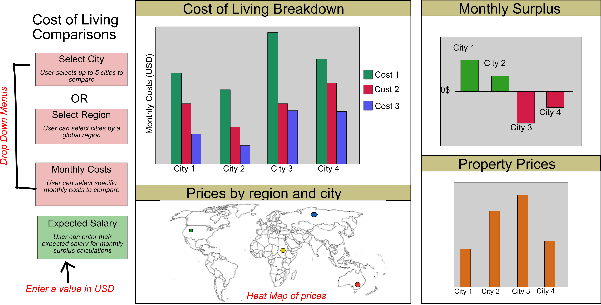

# Exploring the cost of living
- authors: Affrin Sultana, Arushi Ahuja, Jiwei Hu, Margot Vore

This R-based dashboard is designed to help new college graduates explore the cost of living in different major cities around the world. We have designed our dashboard to give the user flexibility to compare the breakdown of monthly expense from different cities using a series of drop-down menus. We are planning on providing 4 different menus for the users to explore. The first menu allows the user to pick up to 6 different global cities to compare living expenses across, with all expenses shown in USD regardless of the location. If the user is unsure what cities they are interested in but want to explore a given region of the world, drop down menu two will allow users to select a global region, which will display all cities within the selected area. The third drop down menu allows the user to select a subset of monthly expenses to explore from average rent prices and monthly food expenditures. Finally, the user will be able to enter their expected salary in order to compare how their monthly wages will compare to their monthly expenditures. 

We are aiming to create 4 different visualizations within the dashboard. The first plot will be a bar chart that shows the breakdown of monthly expenses per city selected by the user. The second chart will show the surplus or deficit of living in each selected city, considering all monthly expenses and the users expected salary. The third plot will show the prices of buying a property and the 4 plot will be a heat map which spatially depicts living expenses in cities of interest. 
 
 
 

## Setup Instructions
To run the app locally and reproduce yourself, fork this repo and follow the below steps in your local repository root:

1. `cd Cost_of_living_r`
2. `Rscript init.R`
3. Comment out `app$run_server(host = '0.0.0.0')` in the app.R file (this is just for Heroku deployment) and switch it to `app$run_server(debug = F)`. 
3. `Rscript app.R` 
4. Enter the local server URL into your browser: http://127.0.0.1:8050

# License
Licensed under the terms of the MIT license.

